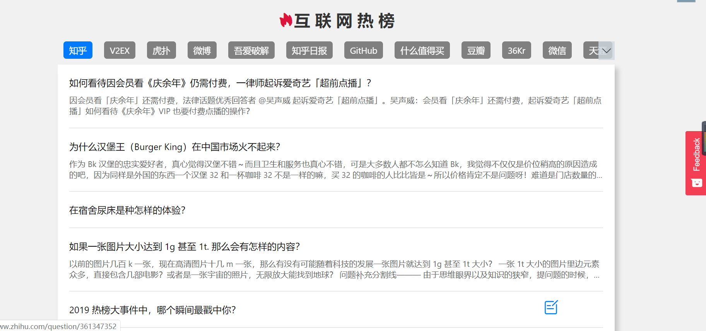

## 互联网热榜

> 关注世界的变化，了解舆论的风向，尽在互联网热榜。

## 线上地址

* [互联网热榜](https://hot.telami.cn/)

## 支持 hot

如果你喜欢hot的话, 可以给我点个 ⭐ [GitHub](https://github.com/telami/hot), 或者推荐给朋友一下。

## 感谢

* [printf520](https://www.printf520.com/hot.html): 感谢v友提供的api。

* 

## 协议

[MIT](./LICENSE)
